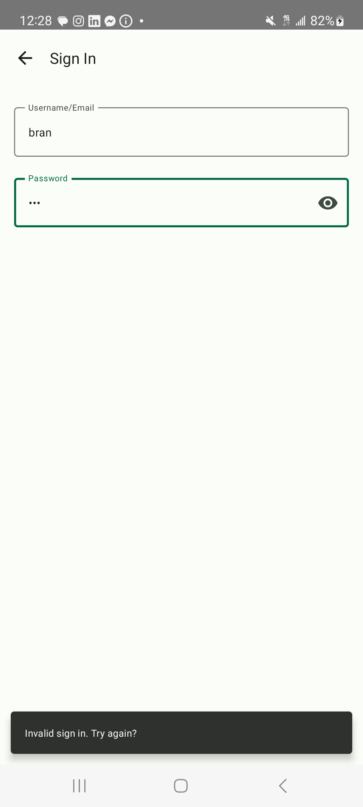
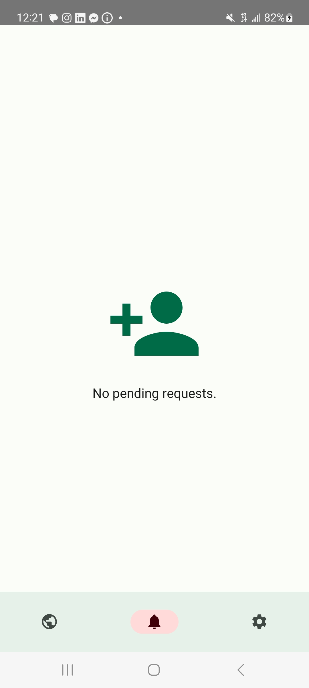

# SmallWorld
Anyone who's an avid traveller knows that you meet countless people when travelling, people you would love to see again but too many to keep track of. SmallWorld solves this problem. Add anyone you meet travelling and as they update their location from city to city, country to country, continent to continent, you'll always know if you cross paths again, whether it be during the same trip, years later on different travels, or better yet, in their own hometown.

**Disclaimer:** this app is a proof of concept. I wrote it to get back in touch with programming, explore new tools, experiment with back-end development, for fun, and because I wanted a codebase that was entirely my own to play with. The UI is far from perfect, and many features remain to be implemented for it to be a truly useful application.

## Features
- Create an account
- Sign in
- Search users by username
- Send friend requests
- Accept friend requests
- Refuse friend requests
- Update your location
- View your friends on the map

## Screenshots

## Backlog

Can be found at https://trello.com/b/QaDqhX3Y/smallworld

## Code Repos

Android: https://github.com/germaindudek/smallworld-android
 Server: https://github.com/germaindudek/smallworld-server

## Licence

 Smallworld is licenced under the Creative Commons Attribution-NonCommercial-ShareAlike (CC BY-NC-SA) 4.0 International License. To view a copy of this licence, visit https://creativecommons.org/licenses/by-nc-sa/4.0/x